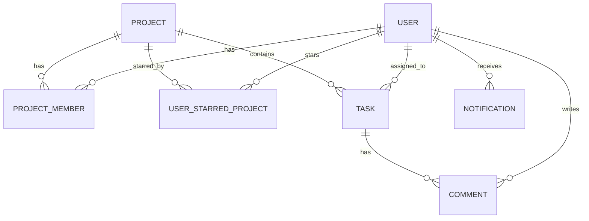

<p align="center">
  
  
  
  
</p>

<h1 align="center">⚡ TaskFlow</h1>

<p align="center">
  <strong>A premium, beautifully crafted team task management application.</strong>
  <br>
  <em>Organize projects, interact with smooth Kanban boards, collaborate in real-time comment threads, and view robust analytics within one secured workspace.</em>
</p>

<p align="center">
  <a href="#-the-problem">The Problem</a> •
  <a href="#-what-taskflow-adds">What TaskFlow Adds</a> •
  <a href="#-quick-start">Quick Start</a> •
  <a href="#-architecture">Architecture</a> •
  <a href="#-how-it-works">How It Works</a> •
  <a href="#-database-schema">Database Schema</a> •
  <a href="#-api-endpoints">API Endpoints</a> •
  <a href="#-development-playbook">Development</a>
</p>

---

## 🤔 The Problem

Aligning team efforts across project boards often gets messy and insecure:

- **Static lists** fail to represent dynamic progress or project state transitions.
- **Fragmented tools** split conversation threads, task metadata, and notifications.
- **Inadequate access controls** lead to private workspace information leaking to non-members.
- **Vulnerabilities** such as clickjacking, CSS injection, MIME spoofing, and brute-force auth requests put sensitive institutional data at risk.

**TaskFlow brings these pieces together** into a single, cohesive, modern workspace with strict **Role-Based Access Control (RBAC)** boundary isolation.

---

## ✨ What TaskFlow Adds

| Capability | Without TaskFlow | With TaskFlow |
|:---|:---|:---|
| **Board View** | Static boards, laggy card tracking | Fluid, interactive Kanban boards with glassmorphic styles & framer-motion micro-animations |
| **Data Separation** | Single shared database with global read permissions | Absolute workspace separation—users only access projects they are active members of |
| **Endpoint Security** | Loose authorization on REST routes | Strict middleware validations for project, task, search, comment, and delete endpoints |
| **Brute-Force Guard** | Vulnerable login endpoints | Memory-cached sliding-window **Auth Rate Limiter** (max 10 requests / 15 min per IP) |
| **Browser Hardening** | Standard header responses | Customized HTTP security headers: CORS origin whitelist, strict CSP, XSS-busting, and Frame Options `DENY` |
| **Collaboration** | Dispersed chat rooms, disjointed threads | Integrated task-level comment threads and chronologically indexed Activity Feeds |
| **Team Analytics** | Manual spreadsheet summaries | Real-time Dashboard KPIs, overdue counter, and chronological upcoming tasks list |

---

## 🏃 Quick Start

View your app in AI Studio: [https://ai.studio/apps/066946b6-4d11-43be-bae7-3aeed8bc68f5](https://ai.studio/apps/066946b6-4d11-43be-bae7-3aeed8bc68f5)

### Prerequisites
*   Node.js (v18 or higher) and npm/yarn OR
*   Docker and Docker Compose

### Option A: Standard Local Setup

#### 1. Install dependencies
```bash
npm install
```

#### 2. Set up environment variables
Create a `.env.local` file in the root directory (using `.env.example` as a guideline) and add your `GEMINI_API_KEY`:
```bash
GEMINI_API_KEY="your-api-key-here"
```

#### 3. Initialize & Seed Database
```bash
npm run db:migrate   # Applies SQLite schema migrations
npm run db:seed      # Seeds demo users, projects, tasks, and comments
```

#### 4. Run Locally
```bash
npm run dev          # Starts Vite dev server (port 3000) and Express (port 3001)
```

### Option B: Docker Container Setup
If you prefer running in a containerized environment:
```bash
# Build and run the service
docker-compose up -d --build
```
The application will automatically build in a production-ready environment, run database migrations, seed mock data, and expose the application at `http://localhost:3050`.


---

## 🏗️ Architecture

```text
┌────────────────────────────────────────────────────────┐
│                      Web Client                        │
│   (Vite, React 19, Tailwind CSS v4, Motion, Lucide)     │
└──────────────────────────┬─────────────────────────────┘
                           │  HTTP Requests / JSON
                           ▼
┌────────────────────────────────────────────────────────┐
│                     Node/Express                       │
│    (Zod Validation, JWT Auth Middleware, rateLimiter)   │
└──────────────────────────┬─────────────────────────────┘
                           │  ORM Queries
                           ▼
┌────────────────────────────────────────────────────────┐
│                   Prisma & SQLite                      │
│            (User, Project, Task, Comments)             │
└────────────────────────────────────────────────────────┘
```

### Stack
*   **Frontend**: React (v19), Vite (v6), Tailwind CSS (v4), Motion (animation engine), Lucide React (icons).
*   **Backend**: Node.js, Express, Zod validation, JWT-based security.
*   **Database & ORM**: SQLite managed via Prisma ORM.

---

## 🔄 How It Works

### Seeding Workflow
```text
prisma/schema.prisma
  ──> prisma migrate dev (Dev Database SQLite initialization)
  ──> prisma/seed.ts
  ──> populates canonical users (u1-u5), projects (p1-p3), tasks, & comments
```

### Auth & Rate Limiting Pipeline
```text
POST /api/auth/login or /api/auth/register
  ──> checked by authRateLimiter (Max 10 requests / 15-minute sliding window per IP)
  ──> safety verified? Yes ──> Zod payload validation
  ──> bcrypt password comparison
  ──> JWT token generation & payload return
```

### Access Control Enforcement (RBAC)
```text
Incoming REST API Request (e.g. GET /api/projects/:projectId)
  ──> authMiddleware validates Bearer JWT token & sets req.user
  ──> Endpoint verifies current userId is a member in ProjectMember join table
  ──> Access verified?
        ├── Yes ──> Returns project task lists, metrics, and metadata
        └── No  ──> Responds with 403 Forbidden status
```

---

## 🗃️ Database Schema

The Prisma database schema lives in `prisma/schema.prisma`. It is optimized for high-performance relations and cascading cleanups.

### Mermaid Entity-Relationship Diagram



### Principal Models
*   **`User`**: Core user credentials, initials, avatar URL, and hashed password representation.
*   **`Project`**: Dedicated workspaces with custom names, descriptions, and branding colors.
*   **`ProjectMember`**: Linking model connecting `User` and `Project` with a unique constraint `@@unique([userId, projectId])`.
*   **`UserStarredProject`**: Fast-access collection mapping favorite workspaces onto user dashboards.
*   **`Task`**: Workspace work item with a status (`todo` | `in_progress` | `in_review` | `done`), priority (`low` | `medium` | `high` | `urgent`), due date, and labels.
*   **`Comment`**: Persistent, context-linked messages on task threads.
*   **`Notification`**: Activity records pointing to projects or tasks to trigger alerts.

---

## 🔌 API Endpoints

### Authentication
*   `POST /api/auth/register` — Create a new account *(Rate-Limited)*
*   `POST /api/auth/login` — Sign in to TaskFlow *(Rate-Limited)*
*   `GET /api/auth/me` — Retrieve active profile details
*   `PUT /api/auth/profile` — Update account profile details
*   `PUT /api/auth/password` — Update account security password

### Projects
*   `GET /api/projects` — Fetch projects in which user is a member
*   `GET /api/projects/:id` — Fetch detailed metadata of a member project
*   `POST /api/projects` — Initialize a new project and assign creator as member
*   `PUT /api/projects/:id/star` — Toggle workspace star state
*   `DELETE /api/projects/:id` — Delete a member project *(Cascades tasks/comments)*

### Tasks
*   `GET /api/tasks` — Fetch tasks inside projects where user is a member
*   `GET /api/tasks/project/:projectId` — Fetch filtered tasks of a specific project
*   `GET /api/tasks/:id` — Fetch single task metadata
*   `POST /api/tasks` — Add a task to a project *(Validates poster's project membership)*
*   `PUT /api/tasks/:id` — Edit task fields *(Restricted to project members)*
*   `PATCH /api/tasks/:id/status` — Drag-and-drop status update *(Restricted to project members)*
*   `DELETE /api/tasks/:id` — Delete task *(Restricted to project members)*

### Comments
*   `GET /api/comments/:taskId` — Fetch comments thread for a task *(Project members only)*
*   `POST /api/comments/:taskId` — Post a comment on a task *(Project members only)*

---

## 🏃 Development Playbook

### Code Verification
Before pushing changes or submitting merge requests, compile and verify the workspace:
```bash
npm run lint         # Runs typescript compiler check (tsc --noEmit)
```

### Production Build
Test production assets compilation and packaging:
```bash
npm run build        # Builds frontend client assets & bundles Express server
```

### Docker Container Build & Run
Test compiling the production environment into a Docker container locally:
```bash
docker-compose up -d --build
```
This multi-stage Docker build encapsulates compiling the client SPA using Vite, compiling the server bundle with esbuild, running database migrations, and seeding the SQLite database.


---
*Document maintained by Antigravity AI assistant.*
