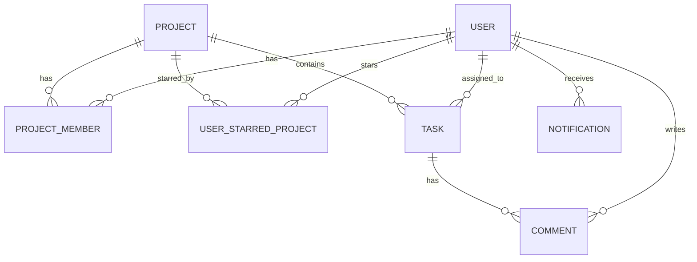

# ♊ Gemini Workspace Documentation — TaskFlow

Welcome! This documentation is specifically curated to help Gemini agents, models, and developers quickly bootstrap their understanding of **TaskFlow**'s architecture, security configurations, database schemas, and current implementation details.

---

## 🚀 Application Overview

**TaskFlow** is a premium, beautifully crafted team task management application featuring fluid interactive Kanban boards, rich data visualizers, collaborative comment threads, and deep filtering mechanics.

### 🛠️ Technology Stack
*   **Frontend**: React (v19), Vite (v6), Tailwind CSS (v4), Motion (animation library), Lucide React (icons).
*   **Backend**: Node.js, Express, TypeScript (`tsx` for execution, `esbuild` for production bundling).
*   **Database & ORM**: SQLite database managed via Prisma ORM.

---

## 🔒 Security & Boundary Isolation (RBAC)

TaskFlow implements a strict **Role-Based Access Control (RBAC)** model where all project-related resources are strictly isolated by **Project Membership**. Users cannot read, search, modify, delete, or comment on any item belonging to a project unless they are an active member of that project.

### 🛡️ Endpoint Protection Summary

| Endpoint Area | Method / Path | Access Rule enforced |
| :--- | :--- | :--- |
| **Projects** | `GET /api/projects` | Only lists projects where the user is a member. |
| **Projects** | `GET /api/projects/:id` | Returns `403 Forbidden` if user is not a member. |
| **Projects** | `DELETE /api/projects/:id` | Only members can delete the project. |
| **Tasks** | `GET /api/tasks` | Lists only tasks inside projects the user is a member of. |
| **Tasks** | `POST /api/tasks` | Validates that the poster is a member of the target `projectId`. |
| **Tasks** | `PUT /api/tasks/:id` | Restricts edits to members of the parent project. |
| **Comments** | `POST /api/comments/:taskId` | Restricts comment posting to members of the parent project. |
| **Search** | `GET /api/search?q=...` | Only returns matching tasks from projects the user is a member of. |
| **Dashboard** | `GET /api/dashboard` | Calculates stats and upcoming lists using only tasks inside member projects. |

### 🛑 Brute-Force Auth Rate Limiter
*   **File**: `server/middleware/rateLimiter.ts`
*   **Behavior**: Enforces a strict sliding window limit of **10 auth requests per 15-minute window** per IP address.
*   **Response**: Returns `429 Too Many Requests` with a dynamic, user-friendly reset timer.

### 🛡️ HTTP Security & CORS
Custom middleware in `server/index.ts` secures the application with industry-standard headers:
*   **CORS**: Dynamic origin checking permitting only authorized client origins (e.g., `http://localhost:3000`).
*   **X-Frame-Options**: `DENY` to prevent clickjacking.
*   **X-Content-Type-Options**: `nosniff` to protect against MIME type spoofing.
*   **Referrer-Policy**: `strict-origin-when-cross-origin`.
*   **Content-Security-Policy (CSP)**: Strict rules restricting script, style, font, and connect domains to approved sources.

---

## 🗄️ Database Schema & Relationships

TaskFlow uses Prisma with SQLite. The database structure is optimized for high-performance relations and cascading cleanups.



### 🔑 Principal Models (`prisma/schema.prisma`):
*   **`User`**: Account holder details, hashed password (`passwordHash`), and unique `initials`.
*   **`Project`**: Workspace workspace containing tasks and custom aesthetic representation (`color`).
*   **`ProjectMember`**: Join model linking `User` and `Project` with a unique constraint `@@unique([userId, projectId])`.
*   **`UserStarredProject`**: Stores favorites for dashboard fast-access.
*   **`Task`**: Work item with `status` (`todo` | `in_progress` | `in_review` | `done`), `priority` (`low` | `medium` | `high` | `urgent`), and tags (`labels` stored as JSON array string).
*   **`Comment`**: Project member discussion message within a task thread.
*   **`Notification`**: Activity feeds pointing to specific project/task.

---

## 🏃 Local Development Playbook

### 💻 Standard Local Setup
Follow these quick commands to spin up the local environment:

```bash
# 1. Install Workspace Dependencies
npm install

# 2. Synchronize / Seed Database
npm run db:migrate   # Applies pending schema migrations
npm run db:seed      # Seeds demo users (u1-u5), projects (p1-p3), tasks, comments

# 3. Launch Development Stack
npm run dev          # Concurrently runs Client (port 3000) and Server (port 3001)
```

### 🐳 Docker Container Deployment
You can also run the entire application in a containerized production environment using Docker:

```bash
# Build and start the container in the background
docker-compose up -d --build
```
This builds a multi-stage Docker image based on Node 22 Alpine, executes migrations & seeds mock data, and exposes the production application at `http://localhost:3050` (mapping to port 3001 internally).


---

## 💡 Quick Tips for Gemini Agents

1.  **TypeScript Verification**: Always run `npm run lint` (`tsc --noEmit`) after making changes to verify compilation health.
2.  **API Integration**: Ensure client-side requests in `src/lib/api.ts` align with backend payload validation schemas powered by Zod.
3.  **Local Auth**: When logging in locally, standard user passwords default to `password123`.

---
*Document maintained by Antigravity AI assistant.*
